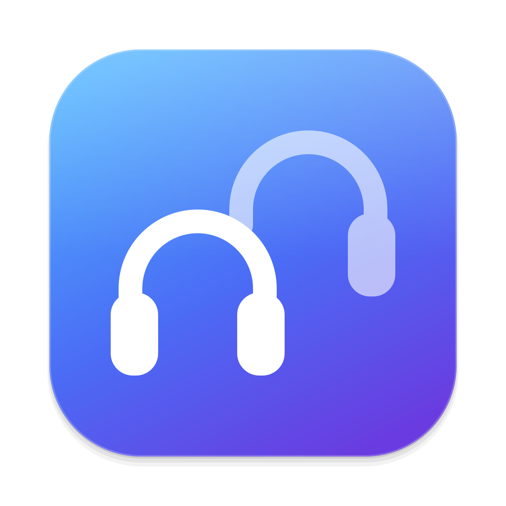

<p align="center">
  
</p>

<h1 align="center">AudioShare</h1>

<p align="center">
  A menu bar app that plays your Mac's audio on several headphones or speakers at once.<br>
  Think <b>Share Audio</b> from iPhone and iPad, for macOS.
</p>

---

## What it does

macOS has no built-in way to listen on two pairs of AirPods at the same time. The only option is building a "Multi-Output Device" by hand in Audio MIDI Setup. AudioShare does it from the menu bar in one click:

1. Click the AudioShare icon in the menu bar.
2. Pick the devices you want to play on from the **Devices** list (at least two).
3. Turn on **Audio Sharing**.

When you turn sharing off, audio goes back to the output you were using before.

## Features

- **Not just AirPods.** Every output your Mac can see is listed: AirPods, Beats, other Bluetooth headphones and speakers, built-in speakers, USB and HDMI audio, and AirPlay.
- **Paired but disconnected devices.** Bluetooth devices you've paired before show up even when they aren't connected. Click one to connect it and add it to the share.
- **Never-paired devices.** **Nearby Devices → Search for Devices** finds headphones in pairing mode and pairs them in one click. For a friend's AirPods, they just hold the button on the case.
- **Per-device volume.** Every selected device gets its own volume slider.
- **Volume keys.** While sharing, the keyboard volume keys raise and lower every device together while keeping their balance. Mute and ⌥⇧ fine steps work too. No permission required.
- **Auto-resume.** If one pair of headphones disconnects (say, back in its case), audio keeps playing on the others and the menu shows "Waiting for …". When it reconnects, sharing picks up on its own. Removing a device yourself switches audio to the one that's left. Your selection is remembered. Choosing a different output in System Settings ends sharing.
- **Feels native.** The menu follows the system's Bluetooth and Sound menus, including Liquid Glass on macOS 26 and later, plus light and dark mode.
- **8 languages.** English, Chinese (Simplified), French, German, Japanese, Portuguese (Brazil), Spanish and Turkish. The language follows your system language.
- Optional launch at login. No Dock icon.

## Installation

Requirements: **macOS 14 (Sonoma) or later**, and either Xcode or just the Command Line Tools (`xcode-select --install`).

```bash
git clone https://github.com/2geik/AudioShare.git
cd AudioShare
make install
```

`make install` builds the app, copies it to `/Applications` and opens it. On first launch macOS asks for Bluetooth access. Click **Allow** so your headphones can be listed.

Other commands:

| Command | What it does |
| --- | --- |
| `make app` | Builds `build/AudioShare.app` |
| `make run` | Builds and runs it from `build/` |
| `make icons` | Regenerates the icons from `Design/*.svg` |
| `make clean` | Removes build output |

## How it works

AudioShare uses Core Audio's `AudioHardwareCreateAggregateDevice` to create a *stacked* aggregate device, which is the same thing Audio MIDI Setup calls a Multi-Output Device. It then makes that device the system output.

- A wired or built-in device is used as the clock source when there is one. Drift compensation is turned on for the other devices.
- The sample rate is set to one every member supports (usually 48 kHz).
- Bluetooth goes through `IOBluetooth`: the list of paired devices, discovery with `IOBluetoothDeviceInquiry`, pairing with `IOBluetoothDevicePair`, and connecting with `openConnection`.
- The device is removed when the app quits. After a crash, the next launch cleans up the leftover device and restores your previous output.

```
Sources/AudioShare/
├── AudioShareApp.swift          Menu bar scene, app lifecycle
├── AudioShareController.swift   Selection, sharing state, merging the device lists
├── OutputDevice.swift           Device model and SF Symbol mapping
├── Audio/                       Core Audio wrappers and the multi-output device
├── Bluetooth/                   Paired devices, discovery, pairing, connecting
├── Views/                       The menu
└── Support/                     Launch at login, volume keys, System Settings links
```

## Known limitations

- **Latency.** Bluetooth headphones play roughly 150–250 ms behind wired or built-in speakers, and a multi-output device can't compensate for that. Two Bluetooth headphones stay in step with each other, so the main use case (two pairs of headphones) works well.
- **System volume.** macOS doesn't support a main volume on multi-output devices. While sharing, the volume slider in Control Center and the menu bar is unavailable. Use the volume keys or the sliders in the AudioShare menu instead. Fixing this fully would take a virtual audio driver or the "system audio recording" permission, and AudioShare deliberately uses neither.
- **Microphone.** If the microphone of a shared AirPods is used (during a call, for example), its Bluetooth link drops to a lower-quality mode.
- **Signing.** The app is ad-hoc signed. macOS may ask for Bluetooth access again after each rebuild. If you copy the app to another Mac, the first launch needs **System Settings → Privacy & Security → Open Anyway**.
- Devices that only support Bluetooth LE Audio (no Classic Bluetooth) don't show up in the search. They appear in the list once paired in System Settings.

## Localization

Strings live in `Resources/<language>.lproj/Localizable.strings`, and the English text itself is the key. To add a language, copy one of the existing files, translate the values, and add the language code to `CFBundleLocalizations` in `Resources/Info.plist`. Translate `InfoPlist.strings` too, since it holds the Bluetooth permission prompt.

## Development notes

- The project is a Swift package. `Scripts/build-app.sh` turns it into an `.app` bundle, so Xcode isn't needed.
- In the macOS 27 SDK `@State` is a macro whose plugin ships only with Xcode. To keep the project building with the Command Line Tools, `MenuRowModifier` spells out `State(initialValue:)` instead.
- When building with the Command Line Tools, SwiftPM's default engine (Swift Build) records the deployment target as the binary's SDK version (`sdk 14.0`). AppKit uses that field to decide whether to use the Liquid Glass look, so `build-app.sh` writes the real SDK version back with `vtool`.
- The icons are drawn as SVG in `Design/` and rendered by `Scripts/render-svg.swift`, which uses AppKit's built-in SVG support.

## License

[MIT](LICENSE)
